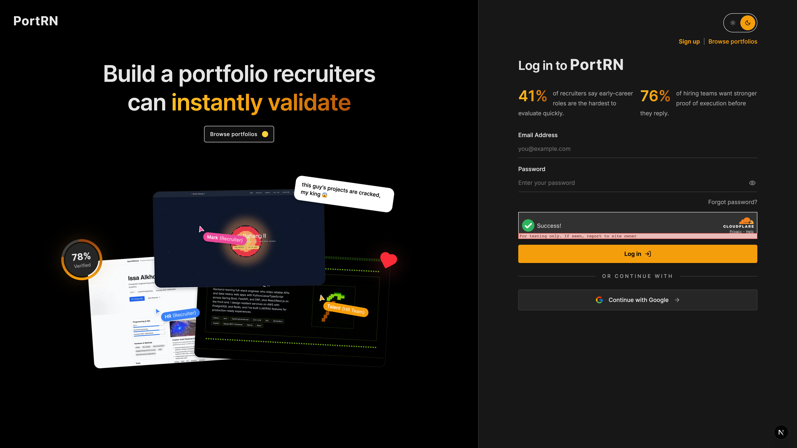
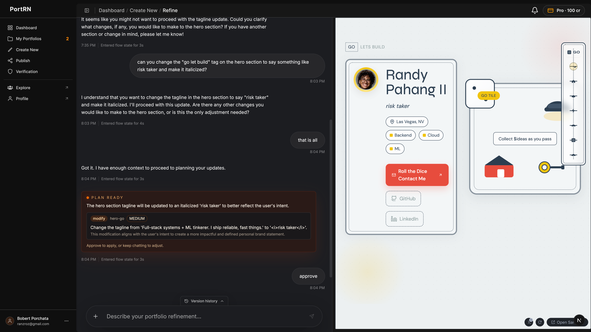
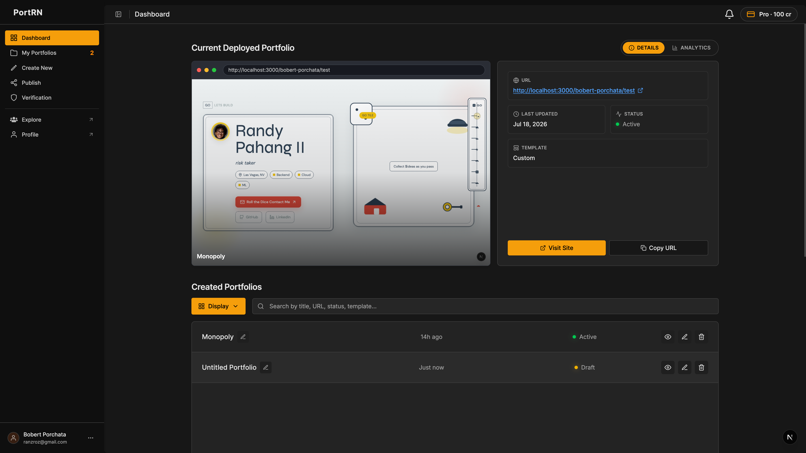
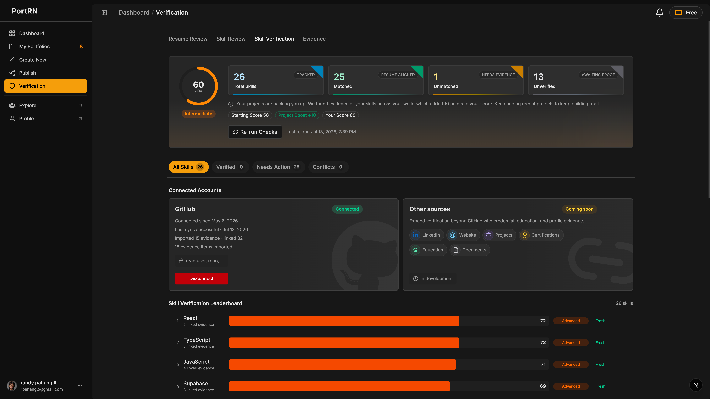
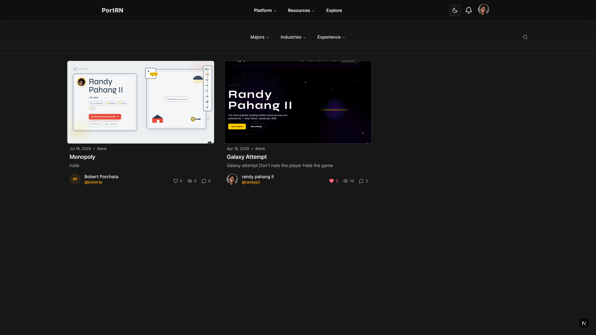
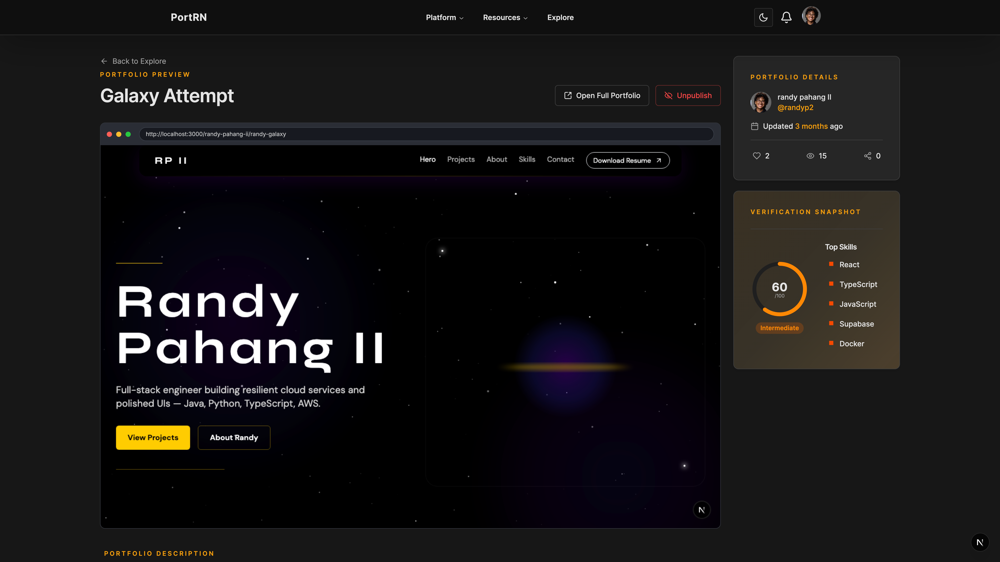
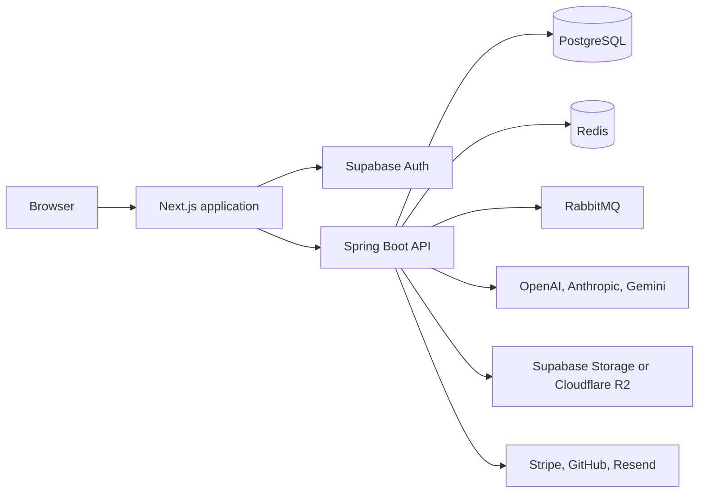

# PortRN

PortRN turns a resume and supporting work into a polished portfolio website. Users can generate a site with AI, refine it in a live editor, publish it, verify professional skills, and engage with other portfolios from one platform.

<!-- Screenshot: Capture the signed-out landing page at 1440 x 900 in light mode. Save it as 01-landing-page.webp. -->


## What PortRN includes

- Resume ingestion for PDF and DOCX files, with structured review before generation
- Guided style selection for typography, color, tone, and layout
- AI portfolio generation with section-level validation and repair
- A live preview editor with conversational refinement and version history
- Public portfolio publishing, profile pages, HTML export, and external site ownership verification
- Skill verification through resume claims, GitHub evidence, and uploaded artifacts
- Explore, likes, comments, follows, notifications, and portfolio analytics
- Subscription, credit, invoice, and customer portal flows powered by Stripe

## Product tour

### Build and refine with AI

Choose a visual direction, generate a portfolio from real experience, and refine individual sections through chat while the preview updates alongside the conversation.

<!-- Screenshot: Capture /dashboard/create/refine with a generated portfolio in the preview and a useful refinement conversation visible. Save it as 02-ai-portfolio-builder.webp. -->


### Manage work from one dashboard

Track recent portfolios, publishing state, engagement, and activity from the authenticated dashboard.

<!-- Screenshot: Capture /dashboard with at least two portfolio cards and populated analytics. Save it as 03-portfolio-dashboard.webp. -->


### Back skills with evidence

PortRN converts resume skills into reviewable claims and supports verification through connected repositories and uploaded evidence.

<!-- Screenshot: Capture /dashboard/verification with a populated score, several skills, and evidence sources visible. Save it as 04-skill-verification.webp. -->


### Discover portfolios

The Explore experience gives published work a community surface with profiles, likes, comments, follows, and notifications.

<!-- Screenshot: Capture /explore with several high-quality portfolio cards and no open menus or loading states. Save it as 05-explore.webp. -->


### Publish a responsive portfolio

Generated portfolios are published to a shareable profile and slug route, with isolated rendering for each portfolio theme.

<!-- Screenshot: Capture the strongest published portfolio at its public /{profile}/{slug} route. Save it as 06-published-portfolio.webp. -->


## Architecture



The Next.js application owns the user interface, authentication session, and server-side API proxy routes. The Spring Boot service owns portfolio generation, persistence, verification, billing orchestration, background work, and public portfolio data.

## Technology

| Area | Main technologies |
| --- | --- |
| Frontend | Next.js 16, React 19, TypeScript, Tailwind CSS 4, TanStack Query, Zustand, Sandpack |
| Backend | Java 25, Spring Boot 3.5, Spring AI, Spring Security, JPA, Flyway |
| Data and jobs | PostgreSQL, Redis, RabbitMQ |
| Authentication and storage | Supabase, Cloudflare R2 |
| AI providers | OpenAI, Anthropic, Google Gemini |
| Product integrations | Stripe, GitHub OAuth, Resend, Cloudflare Turnstile |
| Testing | Vitest, Testing Library, JUnit 5, Spring Boot Test |

## Repository layout

```text
website-generator-app/
├── frontend/           # Next.js application, UI, and API proxy routes
├── webgen-backend/     # Spring Boot API, workers, migrations, and AI workflows
└── docs/readme/        # Drop-in screenshots referenced by this README
```

## Local development

### Prerequisites

- Node.js 20.9 or newer
- npm
- Java 25
- Docker with Docker Compose
- A Supabase project
- API keys for the AI providers enabled in your environment

### 1. Configure the environment

From the repository root:

```bash
cp website-generator-app/frontend/.env.example website-generator-app/frontend/.env.local
cp website-generator-app/webgen-backend/.env.dev.example website-generator-app/webgen-backend/.env.dev
```

For the frontend, configure Supabase, the public site URL, and the backend URL. Local defaults are:

```dotenv
NEXT_PUBLIC_BACKEND_URL=http://localhost:8080
NEXT_PUBLIC_SITE_URL=http://localhost:3000
```

For the backend development profile, configure Supabase and the AI provider keys in `.env.dev`. The included startup script currently validates `SUPABASE_PROJECT_URL`, `SPRING_AI_OPENAI_API_KEY`, and `SPRING_AI_ANTHROPIC_API_KEY` before it starts.

Set the same strong `INTERNAL_API_SECRET` value in both environment files if the internal frontend-to-backend request gate is enabled. Configure GitHub, Stripe, Resend, R2, Upstash, and Turnstile variables when exercising those integrations. Never commit populated environment files.

### 2. Start local infrastructure

```bash
cd website-generator-app/webgen-backend
docker compose up -d
```

This starts PostgreSQL on `localhost:5433`, Redis on `localhost:6379`, RabbitMQ on `localhost:5672`, and the RabbitMQ management interface on `http://localhost:15672`.

### 3. Start the backend

In a new terminal from the repository root:

```bash
cd website-generator-app/webgen-backend
./start-backend.sh dev
```

The API runs on `http://localhost:8080`. Flyway applies the database migrations when the application starts.

### 4. Start the frontend

In another terminal from the repository root:

```bash
cd website-generator-app/frontend
npm install
npm run dev
```

Open `http://localhost:3000`.

## Quality checks

Run the frontend checks:

```bash
cd website-generator-app/frontend
npm test
npm run lint
npm run build
```

Run the backend test suite:

```bash
cd website-generator-app/webgen-backend
./mvnw test
```

Tests tagged `requires-fixtures` are excluded by default through the Maven configuration.

## Production builds

Build and start the frontend:

```bash
cd website-generator-app/frontend
npm ci
npm run build
npm start
```

Build the backend JAR:

```bash
cd website-generator-app/webgen-backend
./mvnw clean package
java -jar target/webgen-backend-0.0.1-SNAPSHOT.jar
```

The backend also includes a multi-stage `Dockerfile` with the Chromium dependencies required for Playwright screenshot capture. Use `.env.prod.example` as the production configuration checklist and supply secrets through the deployment platform.

## Screenshot drop-in directory

README screenshots belong in `website-generator-app/docs/readme/`. The six expected filenames are already referenced above, so adding correctly named WebP files to that directory requires no README changes.
